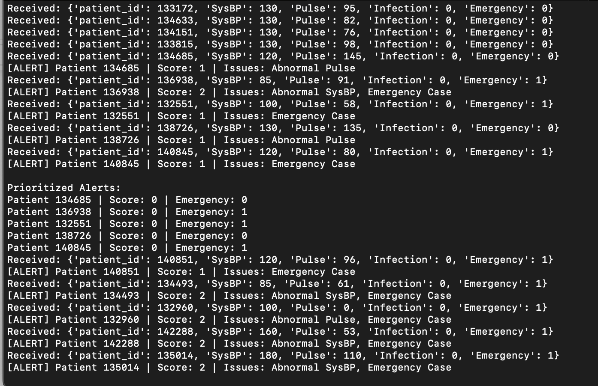

# Anomaly Detection in ICU Patient Monitoring

> A three part data science project demonstraing interpretable and real-time anomaly detection in ICU patient vitals, enhanced by adaptive alert prioritization. 
---

## Overview

This repository contains three moddular systems for detecting anomalies in ICU vital signs:

- A classic time-series model (ARIMA/ETS)

- A real-time streaming anomaly detector with Kafka + unsupervised ML

- A dynamic alert prioritization engine that adapts based on clinician feedback (simulated)

Originally developed across two graduate-level Harvard courses, the project progresses from interpretable statistical models to fully-streamed real-time pipelines with feedback-driven alert management.

---

##  Project Modules

### 1. [`legacy_stats_model/`](./legacy_stats_model/)
- Applies ARIMA & Exponential Smoothing for anomaly detection in SysBP & Pulse
- Defines confidence-based thresholds to flag anomalies 
- Emphasizes interpretability to support clinicians
---

### 2. [`kafka_streaming_model/`](./kafka_streaming_model/)

- Streams patient vital signs using a Kafka producer-consumer pipeline 
- Detects anomalies using Isolation Forest and One-Class SVM
- Includes SHAP for explainability and clustering for patient similarity insights

### 3. [`realtime_alert_system/`](./realtime_alert_system/)
- Consumes anomaly alerts from Kafka in near real-time
- Score alerts based on vitals(SysBP, Pulse) and emergency
- Incorporates simulated clinician feedback to adapt alert rankings over time
- Near real-time performance(~1 second latency per record)


<sub> The Kafka consumer console demonstrates real-time processing patient vitals:
- Records are streamed one by one from the producer.
- Anomalies are flagged based on:
   - Abnormal Pulse
   - Out-of-range SysBP
   - Emergency admissions
- Alerts are assigned a severity score based on the number and type of triggered conditions.
- The system then prioritizes alerts dynamically based on severity and feedback bias. </sub>


---

## Dataset

- **Source**: [Kaggle - Predict Mortality of ICU Patients](https://www.kaggle.com/datasets/msafi04/predict-mortality-of-icu-patients-physionet)
- **Size**: 12,000 ICU time series segments from 4,000 unique patients
- **Format**: 48-hour windows of vital signs, lab results, and static features per patient stay
- **Key Features**:
  - `SysBP`: Systolic Blood Pressure
  - `Pulse`: Heart rate
  - `Survive`: Survival outcome
  - `Infection`: Infection presence (e.g., MRSA/sepsis)
  - `Emergency`: Binary indicator for emergency admission

**Note**: Data was preprocessed to filter valid vitals (SysBP, Pulse), select relevant features, and standardize time windows to simulate real-time streaming.

---

## Use Case
This system simulates key components of a clinical decision support tool for ICU settings, enabling:
- Early detection of life-threatening patient instability
- Real-time alerting with severity scoring
- Feedback-driven alert prioritization for ICU clinicians
- A rapid prototyping framework for healthcare ML applications

---

## Impact & Highlights

**Clinical Relevance**: Emulates an early-warning system to detect high-risk patient deterioration using vital trends and emergency indicators, with the goal of expediting medical response.

**Burnout Reduction**: The prioritization module helps reduce non-critical alerts and cognitive overload — a major issue in modern ICUs.

**System Performance**:
- **Patients Streamed**: ~750 records
- **Abnormal Cases Detected**: 647 (via mixed_focus.csv)
- **Anomaly Detection Latency**: ~1 second per record
- **Alert Batching**: 5-records windows
- **Severity Scoring**: Combines vital abnormalities and admission type 

**Technical Breadth**:
- **Data Ingestion**: Kafka-based streaming architecture
- **Anomaly Detection**: Isolation Forest, One-Class SVM
- **Rule-Based Scoring**: Severity calculated via abnormal Pulse, SysBP, or emergency case
- **Adaptability**: Recommender system adjusts priorities using clinician feedback
- **Explainability**: SHAP integration available for unsupervised models
- **Streaming Performance**: Real-time architecture built with Python and Kafka


**Next Steps**:
- Integrate lab results and medications for multimodal anomaly detection
- Deploy real-time alert visualization using Streamlit 
- Add synthetic feedback loop from clinicians for live tuning
- Scale to HL7/FHIR-compatible environments for EHR integration


---
## Installation 
Clone the repo and install dependencies 
```bash
git clone https://github.com/roshijay/Anomaly-Detection-in-ICU.git
cd Anomaly-Detection-in-ICU
pip install -r requirements.txt
```
---
# How to Run 
- 1. Run the legacy Staistical Model( ARIMA/ETS)
     ```bash
     cd legacy_stats_model
     jupyter notebook legacy_model.ipynb  # or run legacy_model.py
     ```

- 2. Run the Real-time streaming + Alert Priorization Pipeline 
     Terminal 1: Kafka producer(Patient records)
     ```bash 
     cd realtime_alert_system/kafka_bridge 
     python producer.py
     ```

     Terminal 2: Kafka consumer(Anomaly Detection + Alert Ranking) 
     ```bash 
     cd realtime_alert_system/kafka_bridge 
     python consumer.py
     ```

---
# Requirements 
- This project is split into two main components, each with its own set of core dependencies:

  1. Legacy Statistical Model (ARIMA/ETS)
     *Interpretable time-series forecasting using classic statistical methods.*
     Libraries:
     - pandas, numpy: Data manipulation
     - matplotlib, seaborn: Visualization
     - statsmodel-ARIMA, Exponential Smoothing modeling
     - jupyter: Running notebooks interactively
       
  2. Real-Time Kafka Model + Recommender
     *Anomaly detection + alert prioritization pipeline with streaming support.*
     Libraries:
     - pandas, numpy, scikit-learn – Data handling & ML
     - kafka-python – Kafka producer/consumer
     - shap – Model explainability
     - time, json, os – Python standard libs for IO and formatting

---
# Project Structure 
```
Anomaly-Detection-in-ICU/
│
├── legacy_stats_model/                  # ARIMA/ETS time-series model
│   ├── legacy_model.ipynb
│   └── README.md
│
├── kafka_streaming_model/               # Kafka stream + unsupervised ML
│   ├── producer/
│   ├── consumer/
│   └── README.md
│
├── realtime_alert_system/               # Real-time alert pipeline (modular)
│   ├── kafka_bridge/                    # Kafka producer and consumer scripts
│   ├── streamlit_ui/                    # (Optional) Streamlit feedback interface
│   ├── alert_prioritizer.py             # Rule-based alert scoring and ranking
│   ├── recommender.py                   # Feedback-aware bias adjustment
│   ├── feedback_loop.py                 # Placeholder for clinician feedback tracking
│   ├── integrator.py                    # (Planned) Orchestrates alert + feedback
│   └── __pycache__/                     # Compiled bytecode (auto-generated)
│
├── data/                                # Processed dataset (Kaggle ICU subset)
│   └── processed_kaggle_icu.csv
│
├── requirements.txt                     # Dependencies for all components
└── README.md    
```
---


  
